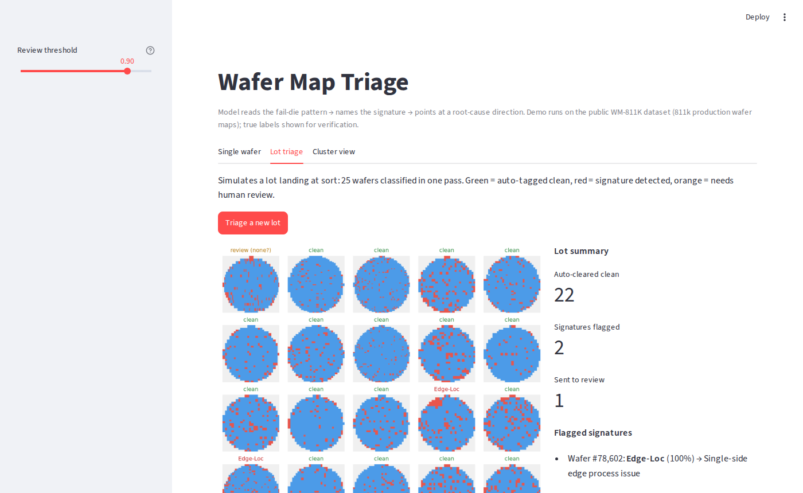

# Wafer Map Triage

An ML tool that reads wafer maps, names the failure signature, and points at a
root-cause direction — the call a defect engineer makes by eye, automated on
every wafer.



## Run it

Live demo: **https://wafer.baselinetech.ie**

```bash
pip install -r requirements-app.txt
python app.py            # dev — http://localhost:8601
```

Flask API + vanilla-JS frontend (canvas-rendered maps, no framework). A demo
dataset and the trained model ship in the repo — no setup needed. Production:
`gunicorn -w 1 -b 127.0.0.1:8601 app:app`, or the Dockerfile.

Three views: **Single wafer** (classify + diagnose one map), **Lot triage**
(25 wafers in one pass — auto-clear clean, flag signatures, queue ambiguous ones
for review), **Cluster view** (CNN embedding of wafer maps — similar failures
group together; novel signatures appear as new clusters).

## Data

**WM-811K**: 811,457 wafer maps from 46,293 production lots of a real fab
(Wu, Jang & Chen, IEEE Trans. Semiconductor Manufacturing, 2015 —
[download](http://mirlab.org/dataSet/public/)). Each map is a die grid of
0 = outside wafer / 1 = pass / 2 = fail. 172,950 maps carry an engineer-assigned
label across 9 signature classes; 85% of those are "none" — the same imbalance
production data has.

## ML

Maps are resampled to 64×64 and one-hot encoded (outside/pass/fail). Two models,
compared deliberately:

- **Baseline** — 18 engineered features (radial ring densities, projection
  statistics, region geometry) + gradient boosting. Interpretable in fab language.
- **CNN** — 3 conv blocks, 289k parameters, trained with class-balanced sampling
  so rare signatures aren't drowned out by the 85% clean majority.

## Results

Held-out test set, 34,590 wafers at true production class mix:

| | Baseline | CNN |
|---|---|---|
| Macro F1 (9 classes) | 0.84¹ | **0.86** |
| Clean-wafer precision ("none") | 0.973 | **0.988** |
| Edge-Ring F1 | 0.960 | **0.972** |
| Scratch precision | 0.509 | **0.799** |

¹ baseline tested with the clean class capped; the CNN faces the full 85%-clean mix.

The number that decides usefulness is **clean-wafer precision**: at production
ratios, the CNN false-flags fewer than 1 in 90 clean wafers — the difference
between an alarm engineers trust and one they mute. Weakest classes for both
models are small diffuse clusters (Loc) and faint scratches — genuinely ambiguous
at map resolution; the tool routes low-confidence wafers to human review instead
of guessing.

Full walkthrough of the CNN — data, training curves, test results:
[`notebooks/03_supervised_cnn.ipynb`](notebooks/03_supervised_cnn.ipynb).
EDA and the feature baseline are in `01_eda` and `02_baseline`.
